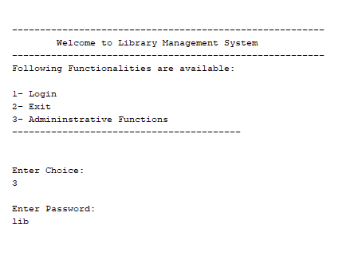
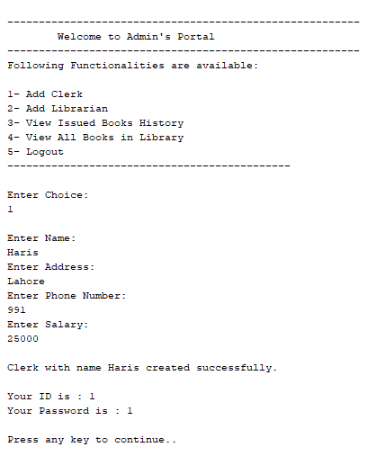
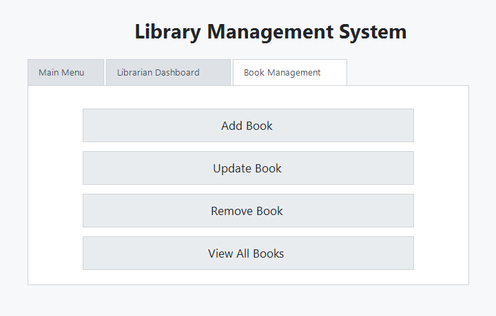

# Library Management System

A Java Library Management System that demonstrates object-oriented design, JDBC persistence, and MySQL-backed data storage. The original console workflow is preserved, and an optional Swing dashboard supports login, book search, and book-management actions.

## Features

- Login flow for borrowers, clerks, librarians, and administrators
- Add clerks, librarians, and borrowers
- Add, search, update, issue, renew, return, and remove books
- Track issued-book history and fine status
- Place and manage hold requests
- Persist library records in MySQL using JDBC
- Optional Swing dashboard for login, search, add, update, remove, and view books

## Technologies

- Java
- JDBC
- MySQL
- Object-Oriented Programming
- Apache Ant

## Database Setup

1. Install MySQL and create a local user with permission to create and update the `lms` database.
2. Run the schema script:

```bash
mysql -u root -p < docs/Database-Schema.sql
```

3. Optional: load demo records for a portfolio walkthrough:

```bash
mysql -u root -p < docs/Seed-Data.sql
```

4. Update `config/database.properties` or set environment variables if your local MySQL credentials differ from the defaults.
5. Start MySQL before running the application.

The application currently connects to:

```text
jdbc:mysql://localhost:3306/lms
user: root
```

Supported environment variables:

```text
LMS_DB_URL
LMS_DB_USER
LMS_DB_PASSWORD
```

## How to Run

Compile and run with Ant:

```bash
ant run
```

Run the Swing dashboard:

```bash
ant run-ui
```

Build the jar:

```bash
ant clean jar
```

Run the domain smoke test:

```bash
ant test
```

The jar is generated at `dist/Library_Management_System.jar`.

The administrative password in the console application is `lib`.

## Screenshots

### Main Menu



### Librarian Dashboard



### Book Management



### Class Diagram


## Project Structure

```text
Library-Management-System/
|-- src/                  # Java source code
|-- docs/                 # Database schema and class diagram documentation
|-- images/               # Curated screenshots and diagrams
|-- libs/                 # Third-party JDBC libraries
|-- config/               # Local database configuration
|-- test/                 # Lightweight domain smoke tests
|-- README.md             # Project overview and setup guide
|-- LICENSE               # MIT license
|-- build.xml             # Portable Ant build script
|-- manifest.mf           # Jar manifest
`-- .gitignore            # Git ignore rules for local/generated files
```

## Portfolio Notes

- Database credentials are configurable through `config/database.properties` or environment variables.
- `docs/Seed-Data.sql` provides demo data for walkthroughs.
- `ant test` runs a lightweight domain smoke test.
- `ant run-ui` launches a Swing dashboard with login, book search, and book-management actions.
