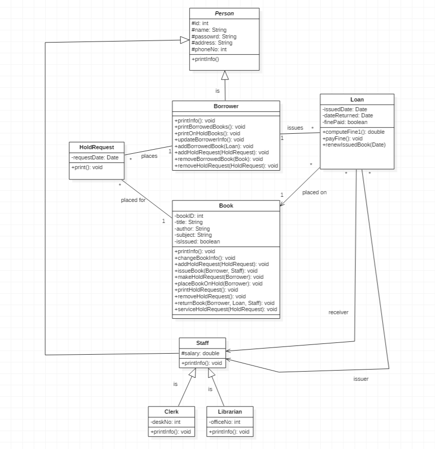

# Class Diagram

The class diagram documents the main domain model for the Library Management System, including people, staff roles, books, loans, and hold requests.

`HoldRequestOperations` coordinates hold-request behavior and reduces direct coupling between `HoldRequest` and `Book`.